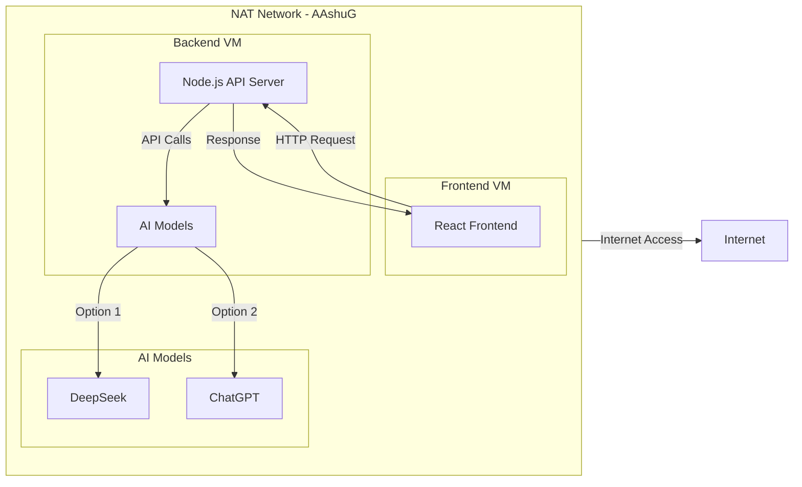

# Distributed Chat Application with AI Models

**Student Information:**

- Name: Ashutosh Gupta
- Roll Number: M23CSE009
- Course: Virtual Cloud Computing
- Assignment 1

## Objective

Create and configure multiple Virtual Machines (VMs) using VirtualBox, establish a network between them, and deploy a microservice-based chat application with AI capabilities across the connected VMs.

## Deliverables

1. **Document Report:** Step-by-step implementation instructions for VirtualBox setup, VM creation, network configuration, and application deployment
2. **Architecture Design:** Detailed diagram showing VM connections and their roles in the microservice application
3. **Source Code Repository:** GitHub repository containing the application code and deployment configurations
4. **Video Demonstration:** Recorded demo of the setup and deployment process with voice-over explanation

## Table of Contents

1. [Document Report](#document-report)
2. [Architecture Design](#architecture-design)
3. [Source Code Repository](#source-code-repository)
4. [Video Demonstration](#video-demonstration)

## Document Report

### Overview

This project implements a distributed chat application with AI model integration using a microservice architecture. The application is deployed across two VMs:

- Frontend VM: Hosts the React-based user interface
- Backend VM: Hosts the Node.js API server and AI model integration

### Step-by-Step Implementation Instructions

#### 1. VirtualBox Setup and VM Creation

1. **Install VirtualBox:**
   - Download VirtualBox from [official website](https://www.virtualbox.org/)
   - Install VirtualBox on your host machine
   - Install VirtualBox Extension Pack for additional features

2. **Create Frontend VM (VM1):**
   - Name: Frontend-VM
   - OS: Ubuntu 22.04 LTS
   - RAM: 4GB
   - Storage: 20GB
   - Network: NAT Network (AAshuG)

3. **Create Backend VM (VM2):**
   - Name: Backend-VM
   - OS: Ubuntu 22.04 LTS
   - RAM: 4GB
   - Storage: 20GB
   - Network: NAT Network (AAshuG)

#### 2. Network Configuration

1. **Configure NAT Network:**

   - Create a new NAT Network in VirtualBox:

     ```bash
     # In VirtualBox Manager
     File -> Tools -> Network Manager -> NAT Networks -> Create
     Name: AshuG
     Network CIDR: 192.168.100.0/24
     ```

   - Configure both VMs to use this NAT Network
   - This allows isolated network communication between VMs
   - VMs can also access the internet through NAT

2. **Configure Network Settings:**

   - Set both VMs to use NAT Network "AAshuG"
   - Note down IP addresses of both VMs using:  

     ```bash
     ip addr show
     ```

   - Ensure both VMs are on the same network segment

3. **Verify Connectivity:**

   ```bash
   # From VM1 to VM2
   ping <VM2-IP>
   
   # From VM2 to VM1
   ping <VM1-IP>
   ```

#### 3. Application Deployment

1. **Backend Setup (VM2):**

   ```bash
   # Install Node.js and npm
   sudo apt update
   sudo apt install nodejs npm

   # Clone repository
   git clone <repository-url>
   cd project/backend

   # Install dependencies
   npm install

   # Configure environment
   echo "OPENAI_API_KEY=your_api_key" > .env
   echo "PORT=3001" >> .env

   # Start the server
   node server.js
   # OR use nohup for background process
   nohup node server.js > output.log 2>&1 &
   ```

2. **Frontend Setup (VM1):**

   ```bash
   # Install Node.js and npm
   sudo apt update
   sudo apt install nodejs npm

   # Clone repository
   git clone <repository-url>
   cd project/frontend

   # Install dependencies
   npm install

   # Start development server
   npm start
   # OR
   # For production build
   npm run build
   npm install -g serve
   serve -s build -l 80
   ```

3. **Configure Firewall:**

   ```bash
   # Allow necessary ports
   sudo ufw allow 3000  # Frontend development port
   sudo ufw allow 3001  # Backend API port
   sudo ufw allow 80    # Frontend production port
   sudo ufw enable
   ```

4. **Monitoring and Logs:**

   a. **Backend Logs:**  

   ```bash
   # View application logs
   tail -f output.log
   # Monitor process
   ps aux | grep node
   ```

## Architecture Design



### Components Description

1. **NAT Network (AAshuG)**
   - Isolated network for VM communication
   - Provides internet access for VMs
   - Enables secure internal communication

2. **Frontend VM (VM1)**
   - React.js application
   - Modern UI interface
   - Model selection capability
   - Real-time chat interface

3. **Backend VM (VM2)**
   - Node.js server
   - Express.js framework
   - AI model integration
   - RESTful API endpoints

4. **AI Models**
   - DeepSeek: Local model via Ollama
   - ChatGPT: OpenAI's GPT-3.5 Turbo

## Source Code Repository

The complete source code is available at: [GitHub Repository Link]

### Repository Structure

```bash
project/
├── frontend/                 # React frontend application
│   ├── src/
│   │   ├── App.js           # Main React component
│   │   ├── App.css          # Styling
│   │   └── index.js         # Entry point
│   └── package.json         # Frontend dependencies
│
└── backend/                 # Node.js backend server
    ├── server.js           # Express server
    ├── .env               # Environment variables
    └── package.json       # Backend dependencies
```

## Video Demonstration

A detailed video demonstration of the setup and deployment process is available at: [Video Link](https://drive.google.com/file/d/19WLZ3b9yZNT7FEDhqBc08t6G11v4zqVp/view?usp=sharing)

The video covers:

1. VirtualBox installation and VM creation
2. Network configuration between VMs
3. Application deployment process
4. Live demonstration of the chat application
5. Testing with both AI models

### Features Demonstrated

- VM creation and configuration
- Network setup and verification
- Application deployment
- Real-time chat functionality
- Model switching between DeepSeek and ChatGPT
- Error handling and response management

## Additional Notes

### ISO 27001 Security Controls Implementation

This project implements several ISO 27001 security controls to ensure information security:

1. **A.9 Access Control**
   - A.9.1.1: Network access control through NAT Network isolation
   - A.9.1.2: User registration and de-registration through VM access control
   - A.9.4.1: Information access restriction through firewall rules

2. **A.12 Operations Security**
   - A.12.1.1: Documented operating procedures (this README)
   - A.12.4.1: Event logging through application logs
   - A.12.6.1: Technical vulnerability management through regular updates

3. **A.13 Communications Security**
   - A.13.1.1: Network controls through VirtualBox NAT Network
   - A.13.1.3: Segregation in networks using VM isolation
   - A.13.2.1: Information transfer policies through secure API endpoints

4. **A.14 System Acquisition, Development and Maintenance**
   - A.14.1.1: Security requirements analysis through architecture design
   - A.14.2.1: Secure development policy through code repository structure
   - A.14.2.5: Secure system engineering principles through microservice architecture

### Security Considerations

1. Properly configure firewalls on both VMs
2. Use HTTPS in production
3. Secure API keys and sensitive data

### Troubleshooting

1. Network Connectivity Issues:
   - Verify VM network settings
   - Check firewall configurations
   - Ensure correct IP addresses

2. Application Issues:
   - Verify all dependencies are installed
   - Check server logs for errors
   - Ensure AI models are properly configured

### Performance Optimization

1. Frontend:
   - Implement message pagination
   - Optimize React renders
   - Add response caching

2. Backend:
   - Implement rate limiting
   - Add request queuing
   - Optimize model responses
